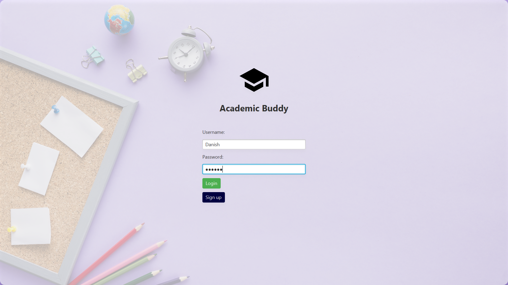
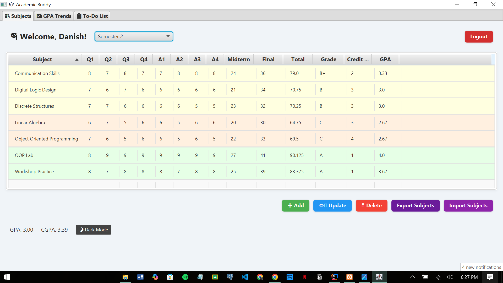
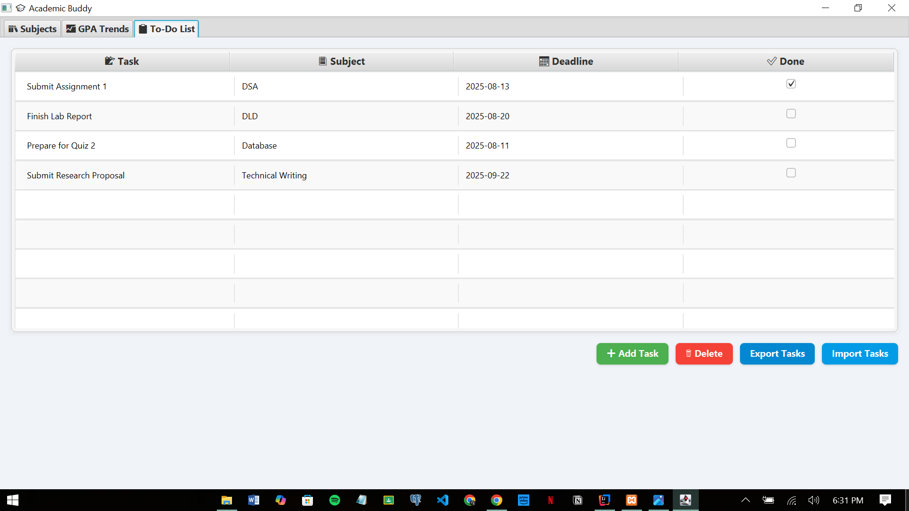
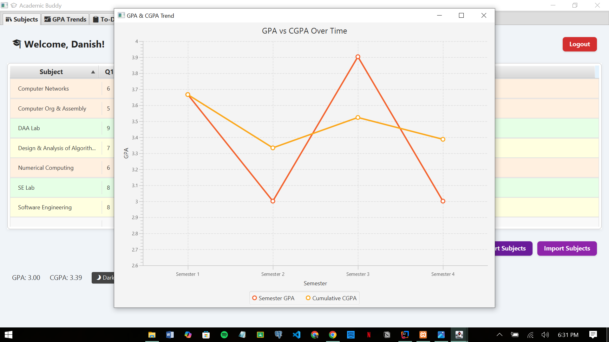

# 🎓 Academic Buddy

Academic Buddy is a JavaFX desktop application that helps students manage subjects, tasks, and track GPA trends. It supports MySQL integration and features export/import functionality.

---

## ✨ Features

- 📘 Subject Manager with grades, GPA calculation, and color-coded table rows
- 📋 To-Do list with subject tagging and deadlines
- 📈 GPA Trends graph
- 🔐 Login authentication with input validation
- 🌓 Light/Dark mode toggle
- 📤 Export / 📥 Import data via CSV files

---

## 📸 Screenshots

Replace the image links below with actual screenshots from your app:

### 🔒 Login Page  

### 📚 Subject Manager  

### ✅ To-Do List  

### 📈 GPA Trends Chart  

---

## 📦 Export / Import

- Export and import your subject or task data as `.csv`
- FileChooser dialogs are used to pick save/load locations

---

## 🛠 Tech Stack

- Java 17  
- JavaFX  
- MySQL (JDBC)  
- SceneBuilder (optional for UI)  

---
